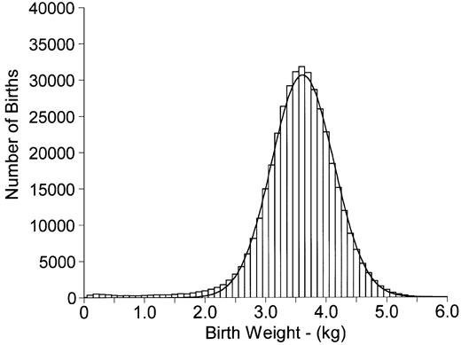
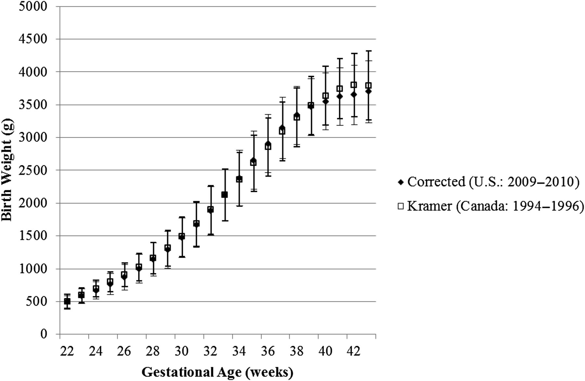

## Birth weight

Birth weight is a commonly-used indicator of a newborn infant's health status. Because this indicator is easily obtained, it is a critical component of population health reporting by the World Health Organization and governments around the globe. The distribution of birth weight has often been described as approximately normal, though the left tail in particular is inflated relative to that from a Gaussian distribution.

## Distribution of birth weight, 1992-1998, Norway

## Variability in birth weight

Much of the variability in birth weight is explained by gestational age at delivery. A baby typically spends around 38 weeks in the uterus, but the average length of gestation is counted at 40 weeks. (Pregnancy is counted from the last day of a woman's menstrual period, which is easily measured, but the date of conception, which is difficult to measure, is typically around two weeks later.)

## <small> Birth weight as a function of gestational age at delivery </small>

{width=70%}

## Case study data

In this case study, you will analyze data on birth weight and gestational age at delivery for babies born in North Carolina from 2011-2016. Relevant variables include the following.

- birth weight in g (primary outcome variable)
- Gestational age in weeks (babies should gain weight until delivery)
- Biological sex assigned at birth (boys are heavier on average)

## Case study data

- Parity, or the woman's number of births including this one (on average, a woman's later babies are expected to weigh more than the first due to incomplete reversion of physiologic changes that occur during pregnancy to facilitate fetal growth, thus creating a more efficient system for later pregnancies)
- Plurality (singleton births usually weigh more than twins or higher-order multiples). Note that including multiple births to a mother (whether at one time or over a period of years) is a violation of any assumption of independence of observations.

## Case study data

- Maternal smoking (smoking is associated with lower birth weight; pregnant women are encouraged to quit smoking)
- Maternal age (be sure to explore nonlinear trends, as very young mothers and older mothers are often at higher risk)
- Maternal race (health disparities in birth weight have been identified in the literature, though mechanisms are largely unknown)
- Hispanic origin of mother
- Year of birth (useful to determine if there are any time trends)
- County of residence (very rough proxy for socio-economic status)

## Case study goals

- determining which factors are associated with birth weight

- characterizing the relationship between each factor and birth weight

- exploring whether fit of linear regression model is adequate or whether robust regression methods are needed

- estimating the impact of eliminating maternal smoking on birth weight

## Task for case study 1 interim report 

Develop an appropriate model for birth weight as a function of the predictors in the data. Produce a 5 page (maximum) report in R markdown that clearly describes your process for model selection and validation. Provide clear interpretations of the associations between each predictor and birth weight in layperson's language.  Figures may be included as appropriate. Code should be fully reproducible.

## Task for case study 1 final report 
Using the model you determine is most appropriate, show the  potential impact of the elimination of maternal smoking on distribution of birth weight. 

If smoking were eliminated, would our expected birth weight distribution match the distribution of birth weight we obtain if we restrict this sample to nonsmokers?  Why or why not? Provide evidence from the data to support your answer and to show the predicted impact of elimination of maternal smoking. 

Code should be fully reproducible and included in your R Markdown document, and any changes in the model from the interim report should be described and justified.  Maximum report length is 5 pages.

