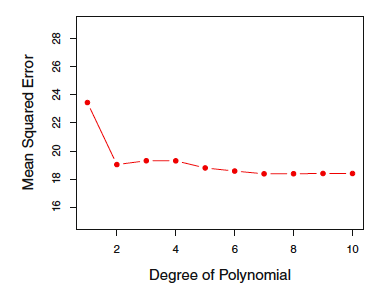
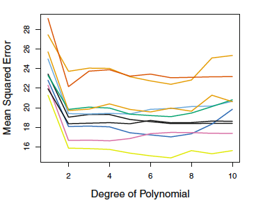

  
```{r setup, include=FALSE}
knitr::opts_chunk$set(echo = TRUE,fig.width=6, fig.height=5)
```

## Skills covered

* Review of linear regression
* Robust regression (M estimation)
* Cross-validation

## Birth weight

Birth weight is a commonly-used indicator of a newborn infant's health status. Because this indicator is easily obtained, it is a critical component of population health reporting by the World Health Organization and governments around the globe. The distribution of birthweight has often been described as approximately normal, though the left tail in particular is inflated relative to that from a Gaussian distribution.


## Dealing with heavy-tailed distributions
Birth weight has heavy tails, or more observations in the tail than a typical normal distribution.

Fitting a linear regression model assumes the data follow an approximate normal distribution. Instead, we may want to consider a parametric family that has heavier tails and therefore better accommodates outliers in the data.

Let's first start with linear regression.


## Read data into R
We will evaluate whether there is a relationship between the response, birth weight, and the predictors gestational age (measured in weeks) and sex.

* Check for NAs in data - appear as 9, 99, 9999 for our variables of interest (birth weight, gestational age, and sex)
* For now, remove the rows with missing values
* Focus on most recent year with data, 2016
```{r readdata}
#Read in birth data
o_data <- read.csv("~/Documents/TEACHING/vitalstats/Yr1116Birth.csv", 
  na.strings=c("9","99", "9999"))
#SEX=1 male, 2 female; male=1 male, 0 female
o_data$male=2-o_data$SEX #binary gender for interpretation

birth_data <- na.omit(o_data)
birth_data_2016=birth_data[which(birth_data$YOB==2016),]
```

## Is birth weight normally distributed?
* Compare histogram of birth weight to a normal distribution parameterized with a mean and variance that is set based on birth weight variable, `BWTG`.
* Do the distributions align?
  
```{r histogram, out.width = '50%', echo=FALSE }
par(mfrow=c(1,2))
hist(birth_data$BWTG, xlab="Birthweight (g)", main="Birthweight Histogram", prob=TRUE, breaks=50)
curve(dnorm(x, mean=mean(birth_data$BWTG), sd=sd(birth_data$BWTG)),
      col="darkblue", lwd=2, add=TRUE, yaxt="n")
hist(birth_data$BWTG, xlab="Birthweight (g)", main="Birth weight Histogram", prob=TRUE, xlim=c(0, 4000), breaks=30)
curve(dnorm(x, mean=mean(birth_data$BWTG), sd=sd(birth_data$BWTG)),
      col="darkblue", lwd=2, add=TRUE, yaxt="n")
```

## Review of linear regression
Let $y_i$ denote the observed response, 'BWTG', for observation $i$, and $x_i$ the observed covariates, 'GEST' and 'male'. Then we aim to fit the model:

$$ y_i = \beta_0 + \beta_1 \text{GEST}_i + \beta_2 \text{male}_i + \epsilon_i $$

When we fit the line, we estimate the coefficients $\mathbf{\widehat{\beta}}= \{\widehat{\beta}_0, \widehat{\beta}_1, \widehat{\beta}_2\}$, where $\widehat{\beta} = (X^\prime X)^{-1} X^\prime Y$.

$$ \widehat{y}_i = \widehat{\beta}_0 + \widehat{\beta}_1 \text{GEST}_i + \widehat{\beta}_2 \text{male}_i  $$
We denote residuals, $e_i = y_i - \widehat{y}_i$ where $\widehat{y}_i$ is the estimated predicted value for observation $i$.

## Model Assumptions
To make inference on the model parameters, $\beta$, we check four assumptions for the linear regression model:

1. The mean of the response, $E(y_i) = \beta_0 + \beta_1 \text{GEST}_i + \beta_2 \text{male}_i$ is **linear function** of the $x_i$ at each value of the predictors $x_i$.
2. The errors, $\epsilon_i$, are **independent**.
3. The errors, $\epsilon_i$, at each value of the predictor, $x_i$, are **normally distributed**.
4. The errors, $\epsilon_i$, at each value of the predictor, $x_i$, have **equal variances**.

Or in summary, we assume the errors, $\epsilon_i$, are independent, normally distributed with zero mean and constant variance:
$$\epsilon_i \overset{\text{iid}}{\sim} \text{Normal}(0, \sigma^2).$$


## Fit regression to data
Let's fit a linear model using the function `lm`. 
```{r firstmodel}
model1 = lm(BWTG~GEST+male, data=birth_data)
summary(model1)
```

## Look at residuals
What do the residuals tell us about model fit?
```{r residuals, out.width= '50%' }
par(mfrow=c(2,2))
plot(model1)
```


## Diagnosing the problem
Diagnostic plots of the model are essential for checking model fit. 

Heavy-tailed data leads to large residuals and large deviations on the QQplot

A few tools for heavy-tailed data:

* Deletion of outliers - often done in practice, but throwing away data is generally a very bad idea
* Transformations (e.g. sqrt(BTWG)) - transforming outcome may fix the skewness but can make interpretting the model more difficult
* Robust regression - use a more flexible regression model to accommodate the data. While there are many methods for robust regression, they share a general strategy of giving lower weight to observations that have large influence on the regression model fit.

## What do we mean by robust?

- We define *robustness* as a lack of sensitivity to small deviations from the model assumptions
- We have particular interest in distributional robustness and the impact of outliers or non-normal distributions on our estimates
- Thus we will call a model robust if it has the following properties
    - Reasonably efficient 
    - Small deviations from the model assumptions will not substantially impair model performance
    - Somewhat larger deviations will not completely invalidate model
    
## Robustness and linear regression

- Linear regression/ordinary least squares is not robust to outliers. In a small- to moderate-sized data set, one observation can have significant impact on estimates.
- Efficiency of least squares is hindered by heavy-tailed distributions
- Diagnostics can be used to detect outliers and influential points, but what do we do once we have identified them?  Is it appropriate to remove them from the data if they represent valid observations?  Often extreme observations (e.g., long-term survivors) are the most interesting in a data set.

<!---
## Bayesian robust regression in R
Consider the Bayesian approach for robust regression using package `brms`.

* We specify the model using the family, Student-t, to describe the response distribution
    + Student's t distribution has heavier tails compared to the normal distribution. 
    + The heaviness of the tails is specified with the degrees of freedom parameter. The larger the degrees of freedom, the closer to normal the distribution becomes.
```{r tregbayes, eval=FALSE}
install.packages("brms", dependencies=TRUE)
require(brms)
fit1 <- brm(formula = BWTG ~ GEST+male ,
            data = birth_data, family = student(), cores = 2)
```

-->


## M-estimation
 M-estimation simply solves estimating equations (similar to likelihood score equations) to obtain weighted estimators of the form $\widehat{\beta}^{(s)} = (X^\prime W^{(s-1)} X)^{-1} X^\prime W^{(s-1)} Y$, where $s$ is step $s$ in an interative algorithm, and $W$ is a diagonal weight matrix. An interative algorithm is needed because the weights generally depend on the residuals, and the residuals depend on the weights. In the special case in which $W$ is the identity matrix, we obtain maximum likelihood estimates (ordinary least squares); in fact, the "M" in M-estimation represents "maximum likelihood-type."
 
## M-estimation

The weight matrix $W$ can be defined in a variety of ways; a popular choice is the use of Huber weights, in which observations with small residuals are given weights of 1, and observations with larger residuals are downweighted:

$\begin{aligned}
w(\epsilon)= &1 ~~~~ \text{for} ~~ |\epsilon| \leq k \\ w(\epsilon)=&\frac{k}{|\epsilon|} ~ \text{for} ~~ |\epsilon|>k.
\end{aligned}$

## M-estimation

The value for $k$ is called a *tuning constant*; smaller values produce more resistance to outliers at the cost of reduced efficiency if errors are in fact normally distributed. The value of $k$ is often tied to $\sigma$; for example, [Fox and Weisberg](http://users.stat.umn.edu/~sandy/courses/8053/handouts/robust.pdf) note that $k=1.345\sigma$ provides around 95\% efficiency when errors are normal but still provides some protection against overly influential outliers. Because the estimate of $\sigma$ itself can be highly sensitive to outliers, often a robust estimate is used instead (e.g., $\frac{MAD}{0.6745}$), where $MAD=\text{median}(|y_i-\text{median}(y)|)$.

## M-estimation in R

We will explore frequentist robust regression via M-estimation using the function `rlm` in the `MASS` package. As a default, this package carries out estimation via M-estimation with Huber weights.

```{r freqrobust}
library(MASS)
fit2 <- rlm(BWTG ~ GEST+male, data = birth_data)
summary(fit2)
```
How do these results compare to those of ordinary least squares?

## M-estimation in R

This robust regression technique works by reweighting the observations with large residuals. Let's look at the observations with the largest and smallest weights. What do you notice?

```{r freqrobust2}
fit2_weights = data.frame(bwt = birth_data$BWTG, gest = birth_data$GEST, 
  resid=fit2$resid, weight=fit2$w)
fit2_weights[order(fit2$w)[c(1:5, (length(fit2$w)-5):length(fit2$w))],]
```

## Measuring model fit

One metric for measuring model fit is the mean squared error (MSE):  $$MSE=\frac{1}{n}\sum_{i=1}^n (y_i-\widehat{y}_i)^2.$$ This value will be small when our predictions $\widehat{y}_i$ are close to the true values $y_i$.

Data used in model development are often called *training data*, with the MSE called the *training MSE*. Ideally, our model would also work well for new data $(x_0, y_0)$: what does our model tell us about what might happen in the future?  

## Training and test data

If we have a large amount of data, we can split our sample into training and test datasets. The test dataset should contain new observations that are not represented in the training dataset. Then a goal is to minimize the *test MSE*, given by $$MSE=\frac{1}{n_{train}}\sum_{j=1}^{n_{train}} (y_{0j}-\widehat{y}_{0j})^2,$$ where $\widehat{y}_{0j}$ is the predicted response for a new observation in the test dataset using the model developed in the training dataset, and $n_{train}$ is the number of new observations in the test dataset.

## Training and test data

Test data are important because of the problem of *overfitting*, which arises when the model is working too hard to find the perfect predictions in the test data and is not broadly generalizable because it has been picking up some patterns that are just reflecting random error. 

We generally expect the test MSE to be somewhat larger than the training MSE because our model has been developed to minimize the training MSE; overfitting refers to a situation in which a different model (generally a simpler one) fit to the training data would result in a smaller test MSE (indicating better out-of-sample prediction).

## Evaluating test MSE


{width=40%}

While it is difficult to choose among higher-order polynomials, it is clear that a linear term in $x$ is insufficient.

## Evaluating test MSE

In a small dataset, the random split of the data can have considerable impact on the results, as seen in this figure (also from James) that shows results from 10 different random 50:50 training:test data splits in a sample of just under 400 observations.

{width=40%}

## Cross-validation

*Cross-validation* is related to the validation set method but addresses the issue of sensitivity of results to the particular random data split obtained.  

*k-Fold cross-validation* involves splitting the data into $k$ mutually-exclusive groups, called *folds*, and then fitting a model on $k-1$ folds (combined) with the $k^{th}$ fold treated as a validation set. We repeat $k$ times (so each fold has a turn as the validation set). We obtain $k$ estimates of the test error and summarize using the average $$\frac{1}{k}\sum_{i=1}^k MSE_i.$$  

## Leave-one-out cross-validation
*Leave-one-out cross-validation*, in which $k=1$, is a special case (more computationally intensive except in special cases). Test error estimates using $k=5$ or $k=10$ have been shown to have good statistical properties, motivating these common choices.

## Leave-one-out cross-validation

In the case of least squares, we can get an estimate of the average MSE from leave-one-out cross-validation using a simple formula (sadly, this does not hold in other models) based on the fit of only one model! This is a great computational savings. The estimate is given by
$$\frac{1}{n}\sum_{i=1}^n \left(\frac{y_i-\widehat{y}_i}{1-h_i}\right)^2,$$ where $h_{i}$ is the $i$th diagonal element of the hat matrix $X(X'X)^{-1}X'$ and is often termed the *leverage*. High leverage points (close to 1) tend to have more of an impact on model fit.


## Class Exercises:
* Evaluate the observations with largest residuals/weights and discuss possible reasons for the large residual
* Divide the data into $k$ folds, where $k$ is the number of group members present, and assign each group member a different validation set (setting a seed may be helpful).  See [helpful code](https://gist.github.com/duttashi/a51c71acb7388c535e30b57854598e77)

## Class Exercises:
* Each member should fit a regression model with birthweight as the outcome and predictors including biological sex, total pregnancies (dichotomized as 1 or >1), smoking status (dichotomized as any versus none), and gestational age (linear term in weeks) on their particular training set and compute the test MSE in their assigned validation set
* Combine results across team members to get the average test MSE
* Now compute average test MSE for a variety of polynomial functions in gestational age to determine a preferred model
* Time permitting, continue model-fitting with `rlm`, exploring the remaining covariates

