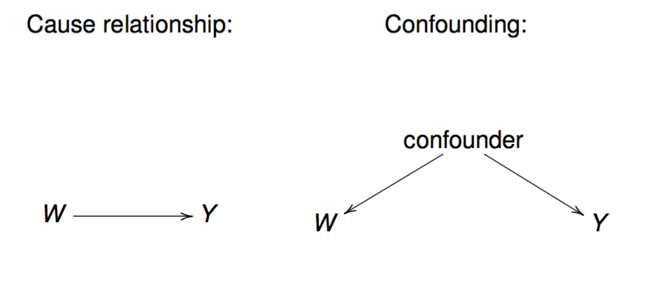

 
```{r setup, include=FALSE}
knitr::opts_chunk$set(echo = TRUE,fig.width=6, fig.height=5)
```


## Causality

Birthweight is a commonly-used indicator of a newborn infant's health status. Because this indicator is easily obtained, it is a critical component of population health reporting by the World Health Organization and governments around the globe.

Can we learn whether a factor may *cause* the increase or decrease in birthweight?

## Correlation does not imply causation 
* A lot of research questions in statistics/machine learning are causal in nature
* Standard statistical analysis aims to infer 'associations' among variables
* Causal analysis aims to infer aspects of the data generating process
  * Requires randomized experiments or causal assumptions 


## Confounding
* Confounding is a major complication between association and causation
* Let $W$ denote treatment, $Y$ outcome, and $X$ the observed covariates
* Confounding variable influences the decision of treatment and outcome
    + Example: W: Education and Y: income - confounder: socio-economic status of the family
```{r , echo=FALSE, fig.cap="", out.width = '70%'}

```
* We will aim to address observed confounders through causal inference frameworks.

## Frameworks for causal inference
* Potential outcome framework also known as counterfactual framework or Neyman-Rubin Causal Model (RCM)

* 3 Integral components to RCM:
       1. Potential outcomes corresponding to the levels of the treatment ($Y(1)$, $Y(0)$) - only one is ever observed
       2. Assignment mechanism (how is treatment assigned to observations? e.g. random assignment)
       3. Outcome model relating potential outcomes and covariates
       
* The causal diagram framework by Pearl using directed acyclic graphics (DAGs)


## Causal Assumptions 
To identify causal effects from observed data, we must make assumptions:

 1. SUTVA - Stable Unit Treatment Value Assumption (often referred to as consistency)
    * If $W_i = 1$, then $Y_i = Y_i(1)$
    * If $W_i = 0$, then $Y_i = Y_i(0)$
 
  * Includes 2 assumptions:
      1. No interference - potential outcome for an individual can depend on what treatment other people receive (e.g. vaccinations)
      2. No different versions of the treatment (e.g. surgery performed by different surgeons - may provide slightly different versions of the treatment)

## Causal Assumptions cont.
  * **Assignment mechanism**: the probabilistic rule that decides which unit gets assigned to which treatment
  
      + In randomized experiments, assignment mechanism is *known* and *controlled* by investigators.
      + In observations studies, assignment mechanism is *unknown* and *uncontrolled*.
  * Properties of assignment mechanism:
      1. Individualistic assignment: treatment assignment for unit $i$ does not depend on outcomes and assignments for other units
      2. Probabilistic assignment: probabilitiy of assignment to treatment is strictly between 0 and 1
        + Every unit has some probability of getting the treatment
      3. Unconfounded Assignment: assignment does not depend on the potential outcomes
        + results in dependence of treatment only on the measured covariates - P(W|X) instead of $P(W|X, Y(0), Y(1))$

## Quick start to causal inference:
The assumptions are needed to infer causal estimands in observational studies. Some estimands that are of interest:

 1. Average Treatment Effect (ATE):   $$ \tau = E[Y_i(1) - Y_i(0)]$$
 2. Average Treatment Effect of the Treated (ATT): $$ \tau = E[Y_i(1) - Y_i(0)| W_i=1]$$
