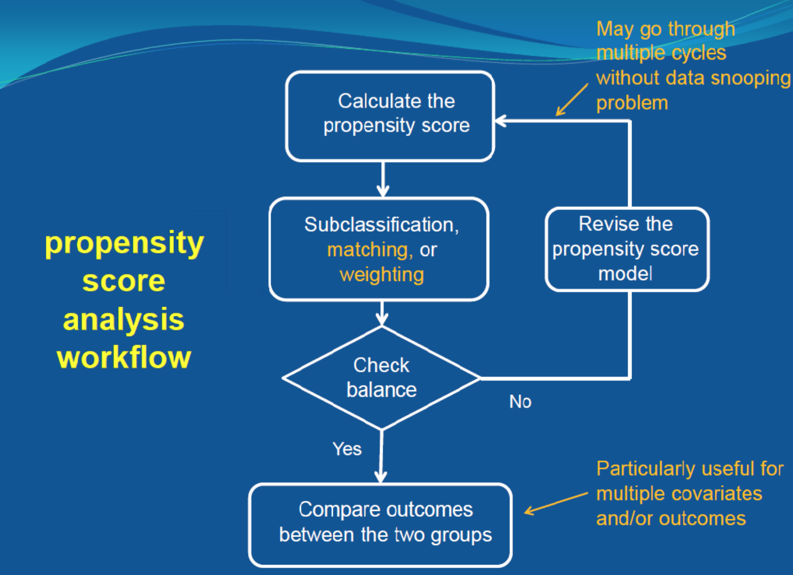

 
```{r setup, include=FALSE}
knitr::opts_chunk$set(echo = TRUE,fig.width=6, fig.height=5)
```


## Case Study 1: Birthweight

Birthweight is a commonly-used indicator of a newborn infant's health status. Because this indicator is easily obtained, it is a critical component of population health reporting by the World Health Organization and governments around the globe.

Can we learn whether a factor may *cause* the increase or decrease in birthweight?


## Correlation does not imply causation 
* A lot of research questions in statistics/machine learning are causal in nature
* Standard statistical analysis aims to infer 'associations' among variables
* Causal analysis aims to infer aspects of the data generating process
  * Requires randomized experiments or causal assumptions 


## Confounding
* Confounding is main complication between association and causation
* Let $W$ denote treatment, $Y$ outcome, and $X$ the observed covariates
* Confounding variable influences the decision of treatment and outcome
    + Example: W: Education and Y: income - confounder: socio-economic status of the family
```{r , echo=FALSE, fig.cap="", out.width = '70%'}
knitr::include_graphics("figures/causal_diagram.png")
```
* We will aim to address observed confounders through causal inference frameworks..

## Frameworks for Causal Inference
* Potential outcome framework also known as counterfactual framework or Neyman-Rubin Causal Model (RCM)

* 3 Integral components to RCM:
       1. Potential outcomes corresponding to the levels of the treatment ($Y(1)$, $Y(0)$) - only one is ever observed
       2. Assignment mechanism (how is treatment assigned to observations? e.g. random assignment)
       3. Outcome model relating potential outcomes and covariates
       
* The causal diagram framework by Pearl using directed acyclic graphics (DAGs)


## Causal Assumptions 
To identify causal effects from observed data, we must make assumptions:

 1. SUTVA - Stable Unit Treatment Value Assumption (often referred to as consistency)
    * If $W_i = 1$, then $Y_i = Y_i(1)$
    * If $W_i = 0$, then $Y_i = Y_i(0)$
 
  * Includes 2 assumptions:
      1. No interference - potential outcome for an individual cannot depend on what treatment other people receive (e.g. vaccinations)
      2. No different versions of the treatment (e.g. surgery performed by different surgeons - may provide slightly different versions of the treatment)

## Causal Assumptions cont.
  * **Assignment mechanism**: the probabilistic rule that decides which unit gets assigned to which treatment
  
      + In randomized experiments, assignment mechanism is *known* and *controlled* by investigators.
      + In observations studies, assignment mechanism is *unknown* and *uncontrolled*.
  * Properties of assignment mechanism:
      1. Individualistic assignment: treatment assignment for unit $i$ does not depend on outcomes and assignments for other units
      2. Probabilistic assignment: probabilitiy of assignment to treatment is strictly between 0 and 1
        + Every unit has some probability of getting the treatment
      3. Unconfounded Assignment: assignment does not depend on the potential outcomes
        + results in dependence of treatment only on the measured covariates - P(W|X) instead of $P(W|X, Y(0), Y(1))$

## Causal Estimands
The assumptions are needed to infer causal estimands in observational studies. Some estimands that are of interest:

 1. Average Treatment Effect (ATE):   $$ \tau = \mathbb{E}[Y_i(1) - Y_i(0)]$$
 2. Average Treatment Effect of the Treated (ATT): $$ \tau = \mathbb{E}[Y_i(1) - Y_i(0)| W_i=1]$$
 3. Conditional Average Treatment Effect (CATE): $$ \tau = \mathbb{E}[Y_i(1) - Y_i(0)| X=x]$$

## Quick start to using causal inference
In oberservational studies, we must adjust for the measured confounding. Some common methods used to do this: 
  1. Covariate-adjusted estimators (e.g. regression, matching)
  2. Propensity Score Methods (e.g. matching and weighting)
  
## Covariate-adjusted estimators
Consider two regressions, one for each potential outcome:
$$ \mathbb{E}[Y(1)|X=x] = \mu_1(x), \quad  \mathbb{E}[Y(0)|X=x] = \mu_0(x)$$

We can fit these using linear regression where
$$ \mathbb{E}[Y(1)|X=x] = \alpha_1 + \beta_1 X_i $$
$$ \mathbb{E}[Y(0)|X=x] = \alpha_0 + \beta_0 X_i $$
The resulting covariate-adjusted ATE estimator is: 
$$ \hat{\tau}_{\text{adj}} = \{\bar{Y_1}^{\text{obs}}-\hat{\beta_1}(\bar{X_1} - \bar{X})\} - 
\{\bar{Y_0}^{\text{obs}}-\hat{\beta_0}(\bar{X_0} - \bar{X})\} $$
where $\hat{\beta}_w$ is the OLS estimate of the coefficient of $X$ in the two regressions.

Note: 1) Validity of the analysis critically relies on the validity of the unconfoundedness assumption (are we accounting for all possible confounders). 2) Also must have correctly specified regression model to result in unbiased causal estimates.


## Propensity Score Methods
Propensity score is defined as the conditional probability of receiving the treatment given the pre-treatment covariates $X$:
$$ e(X) = Pr(W=1|X) = \mathbb{E}(W|X) $$
Properties:

1. Propensity scores balances the distribution of all $X$ between treatment groups: 
$$ W \perp X | e(X)$$
2. If $W$ is unconfounded given $X$, then $W$ is unconfounded given $e(X)$.
  * $e(X)$ is a summary score of the observed covariates
  * We can use this lower-dimensional summary score of the covariates to perform causal inference through stratification, matching, weighting, etc.
  
##Propensity score analysis of causal effects
Propensity score analysis (for observational studies) typically involves two stages:

1. Estimate the propensity score: by a logistic regression or machine learning methods
2. Given the estimated propensity score, estimate the causal effects through one of these methods:
    1. Subclassification
    2. Weighting
    3. Matching
    4. Regression
    5. Mixed procedure of the above
    
## Example of PS Analysis with birthweight data
Does cigarette smoking in the last trimester cause lower birthweight in babies?
```{r}
#Read in birth data
o_data <- read.csv("~/Documents/case-studies/data/2011-2016 Vital Files Duke_Herring/Yr1116Birth.csv", na.strings=c("99", "9999"))

#Remove NAs and restrict to year 2016 - for demonstrations purposes
birth_data <- na.omit(o_data)
birth_data_2016 <- birth_data[which(birth_data$YOB==2016),]
#Create dummy variable for mothers that smoke in last trimester (currently a count variable)
birth_data_2016$smoke_LT <- ifelse(birth_data_2016$CIGLN >0, 1, 0)
```

Let's walk through the steps to perform a propensity score causal analysis with the birthweight data.

 * We will consider treatment ($W$) to be smoking in last trimester
 * Outcome is birthweight

## Stage 1: Estimate the propensity score
Aim of using propensity scores is to ensure **overlap** and **balance** of covariates between treatment groups.

1. For binary treatments, fit propensity score model via logistic regression 

  * Use glm and specify treatment as response, and all possible confounders as predictors
```{r}
ps_mod <- glm(smoke_LT ~ PARITY+GEST+MAGE+as.factor(MRACER)+ as.factor(MHISP), family="binomial", data=birth_data_2016)
```
* Next estimate propensity scores
```{r}
ps <- predict(ps_mod, type="response")
```

## Stage 1: Estimate the propensity score, cont.
2. Check overlap of propensity score between treatment groups, and discard observations with non-overlapping propensity scores
  * Compare distribution of propensity score between treated groups
```{r, echo=FALSE, fig.height=3}
hist(ps[which(birth_data_2016$smoke_LT==0)], col=2, main="Propensity Score Distribution", xlab="propensity score")
hist(ps[which(birth_data_2016$smoke_LT==1)], col=3, add=TRUE)
legend("topright", c("Treated", "Control"), col=c(2,3), pch=c(1,1))
```

* Next discard those units that aren't in the overlapped region
```{r}
ps_0 <- ps[which(birth_data_2016$smoke_LT==0)]
ps_1 <- ps[which(birth_data_2016$smoke_LT==1)]
overlap_ind <- which(ps < max(ps_0) & ps > min(ps_1))
ps_overlap = ps[overlap_ind]
birth_data_overlap = birth_data_2016[overlap_ind,]
```

## Stage 1: Estimate the propensity score, cont.
3. Assess balance of the covariates based on the propensity scores
      1. Create K blocks of $\hat{e(x)}$ based on its quantiles
    ```{r}
      blocks = cut(ps_overlap, quantile(ps_overlap, probs=seq(0,1,by=.2))
                   , labels=c(1:5), include.lowest=TRUE)
    ```
      2. For every covariate, assess the balance within **each of the blocks**, e.g. by a t-test
    ```{r}
      t.test(birth_data_overlap$GEST[which(blocks==1)]~birth_data_overlap$smoke_LT[which(blocks==1)])
    ```
      * if p-value is greater than .05, then we acheive covariate balance!
      
## Stage 1: Estimate the propensity score, cont.
If covariates are unbalanced in one of the blocks, try:

1. Splitting the propensity score into more classes (e.g. K=10) and recheck balance
2. Include higher order terms or interactions in the propensity score model and repeat steps!

Note, the propensity score matching R package (`Matching`) has a built in check balance function that does step 3 for you.

## Stage 1: Overview
```{r, echo=FALSE}

```

## Stage 2: Stratification
We can estimate causal effects using stratification of the propensity score (similar to the check balance procedure above!)

 1. Divide subjects into $K$ strata by the corresponding quantiles of the estimated propensity score
 2. Estimate ATE within each subclass of $e_k$ and then average by the block size.
 
 $$ \hat{\tau}^{\text{ATE}} = \sum_{k=1}^K \{(\bar{Y}_{k,1} - \bar{Y}_{k,0})\}\frac{N_{k,1}+N_{k,0}}{N} $$
 where $N_{k,1}, N_{k,0}$ are the number of units in class $k$ under treated and control.

## Stage 2: Matching
In propensity score matching, the distance metric between observations is the estimated propensity score.

We can use the `Matching` package in R.
```{r, }
library(Matching)
```
 