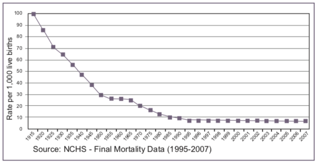
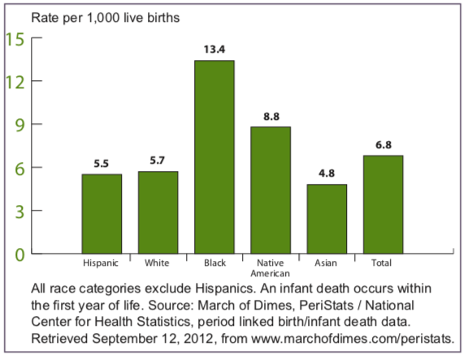
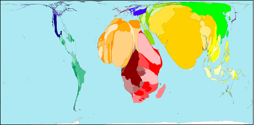

```{r setup, include=FALSE}
knitr::opts_chunk$set(echo = TRUE)
```

## Case Study 2: Data Visualization

Using data relevant to countries around the world, we will explore data science tools to tell complex stories through data visualization. We will consider data on infant mortality in class, and for the report you are welcome to use any data that can be plotted by country.


## Case Study Data

- Information for plotting data by country: http://dev.maxmind.com/static/csv/codes/country_latlon.csv 
- CIA Factbook Data: https://www.cia.gov/library/publications/download/ 
- World Bank Data: https://data.worldbank.org 
- Our World in Data: https://ourworldindata.org 
- Data of your own choosing on world issues

## Case Study Goals

Using data from the World Bank or a complex data source of your own choosing, 
- create a Shiny app in R to illustrate an aspect of our world in data
- create an accompanying Tableau dashboard interactive visual presentation of our world in data
- explain your figures to class in an oral presentation by the group

## Case for Class: Infant Mortality

*Infant death* is defined as the death of a live-born infant during the first year of life. The *infant mortality rate* is the number of infant deaths per 1000 live births. The infant mortality rate, which is relatively easily measured even in resource-poor settings, is often used as a marker of the overall health of a society because of the overlap in causes of infant mortality and factors that are likely to influence the health of an overall population, such as general living conditions, poverty and socioeconomic status, quality of medical care, and rates of illness. Infant mortality rates can be compared across different areas or across time to evaluate the impact of public health program or to determine where new investments in health are needed.

## Changes in US Infant Mortality over Time



What do you think about the way the authors chose to display time in the plot?

## Disparities in Infant Mortality Rate
While overall infant mortality rates in the US have declined over time, major disparities in infant mortality rates exist, shown here as a function of race and ethnicity.
{width=55%}

## Infant Mortality Worldwide

Worldmapper http://archive.worldmapper.org/display.php?selected=261 created a visualization of infant mortality worldwide in 2002, rescaling each country by its contribution to infant deaths worldwide. 

 


## Extracting Latitude and Longitude of Country Centroids

First, we'll want to obtain our latitude and longitude information.

```{r}
latlonDF <-read.csv("http://dev.maxmind.com/static/csv/codes/country_latlon.csv")
```

## Population & Infant Mortality Data
The data files for population and infant mortality are available on the course website. For those of you interested in how to extract this information from the CIA factbook - see the tutorial on the course website.

```{r}
load("data/popDF.RData")
load("data/infMortDF.RData")
```


## Merging the Demographic Data

First we'll combine the demographic data since these come from the same source and consequently should have fewer problems with matching. 

```{r}
IMPop = merge(infMortDF, popDF, by = "ctry", all = FALSE)
```


## Exercise Q.1

In the merge of infMortDF and popDF in Section 11.3 some rows in each data frame were excluded from the resulting data frame. Determine which rows in each data frame did not find a match in the other. 

All the countries in infant mortality are also in the population data set.
```{r}
which((!infMortDF$ctry %in% popDF$ctry))
```
The following countries were in the population data set, but not the infant mortality data set:
```{r}
popDF$ctry[which((!popDF$ctry %in% infMortDF$ctry))]
```

## Merging the geographic and demographic data sets

```{r}
latlonDF$code <- latlonDF$iso.3166.country
allCtryData = merge(IMPop, latlonDF, by.x = "ctry", by.y = "code", all = FALSE)
```


## Initial Plot - The Colors
First, we'll begin by selecting the colors for our plot. We'll select only 5 col- ors, and consequently 5 levels of mortality, because it’s difficult for our eyes to distinguish between more than 5 to 7 colors.

```{r}
library(RColorBrewer)
#display.brewer.all()
cols = brewer.pal(9, "YlOrRd")[c(1, 2, 4, 6, 7)]
```


## Initial Plot - Categorizing Infant Mortality
Next, we'll need to categorize infant mortality so that it can be connected to a color. 
```{r}
# Equally Divide the Range - too many in the lower range
newInfMort = cut(allCtryData$infMort, breaks = 5)
summary(newInfMort)

# Set cut-points based on distrbution - colors more evenly divided
hist(allCtryData$infMort, breaks = 20, main = "",
     xlab = "Infant Mortality per 1000 Live Births")
quantile(allCtryData$infMort, probs = seq(0, 1, by = 0.2))
InfMortDiscrete = cut(allCtryData$infMort,
                      breaks = c(0, 10, 25, 50, 75, 150))
```

## Initial Plot - The Plot
Finally, we're going to create our plot.

```{r}
# Create map
library(maps)
world = map(database = "world", fill = TRUE, col="light grey")

# Add discs

symbols(allCtryData$longitude, allCtryData$latitude, add = TRUE,
        circles= sqrt(allCtryData$pop)/4000, inches = FALSE,
        fg = cols[InfMortDiscrete], bg = cols[InfMortDiscrete])

# Add legend

legend(x = -150, y = 0, title = "Infant Mortality",
       legend = levels(InfMortDiscrete), fill = cols, cex = 0.8)

```

## Initial Plot - Correcting Radius Size
Unfortunately, our choice for the radius has some difficulties because the range of population huge. The small countries have symbols that are so tiny that we can barely see them, if at all, and we certainly can’t see their colors. We will fix this by having a minimum radius, so any country with a population below a certain value is still visible. 

```{r}
# Set minimum radius size
rads = pmax(sqrt(allCtryData$pop)/4000, 1)

# Fix Discs
world = map(database = "world", fill = TRUE, col="light grey")
symbols(allCtryData$longitude, allCtryData$latitude, add = TRUE,
        circles= rads, inches = FALSE,
        fg = cols[InfMortDiscrete], bg = cols[InfMortDiscrete])
legend(x = -150, y = 0, title = "Infant Mortality",
       legend = levels(InfMortDiscrete), fill = cols, cex = 0.8)
```

## Initial Plot - What's Wrong?
Looking at our plot we can see that something is very wrong! Some European countries have much higher population and mortality rates than we'd expect. In particular,  Switzerland and Great Britain seem abnormal.

```{r}
allCtryData[ allCtryData$ctry %in% c("CH","GB"), ]
```


## Exercise Q.2: Corrected Data Merging

We will use the codeMapDF to correct the merging issue and create the correct map.

```{r}
# Fix Data Merging
load("data/codeMapDF.RData")
latlonCtry = merge(latlonDF, codeMapDF, by.x = "code", by.y = "iso", all = FALSE)
IMpopCtry = merge(IMPop, codeMapDF, by.x="ctry", by.y = "cia", all=FALSE)
allCtryData <- merge(latlonCtry, IMpopCtry, by="name")

# Check Data
allCtryData[allCtryData$ctry %in% c("CH", "SZ", "GB", "UK"), ]

```
## Fixing Map 
```{r}
# Redo Map
world = map(database = "world", fill = TRUE, col="light grey")
rads = pmax(sqrt(allCtryData$pop)/4000, 1)
symbols(allCtryData$longitude, allCtryData$latitude, add = TRUE,
        circles= rads, inches = FALSE,
        fg = cols[InfMortDiscrete], bg = cols[InfMortDiscrete])
legend(x = -150, y = 0, title = "Infant Mortality",
       legend = levels(InfMortDiscrete), fill = cols, cex = 0.8)
```


## Bonus: Exercise Q.3
Remake the map in Figure 11.6 to include the countries for which there is latitude and longitude, even if there is no demographic information. 
```{r}
# Remerge the data
allCtryData <- merge(latlonCtry, IMpopCtry, by="name", all.x=TRUE, all.y =FALSE)

# Update the colors & add NA as a level
cols = brewer.pal(9, "YlOrRd")[c(1, 2, 4, 6, 7, 9)]
InfMortDiscrete = cut(allCtryData$infMort,
                      breaks = c(0, 10, 25, 50, 75, 150))
InfMortDiscrete <- addNA(InfMortDiscrete) 

# Add radius size for NA
rads = pmax(sqrt(allCtryData$pop)/4000, 1)
for(i in 1:length(rads)){
  if(is.na(rads[i])){rads[i] <- 1}
}

```

## Q.3: The New Map
```{r}
world = map(database = "world", fill = TRUE, col="light grey")
symbols(allCtryData$longitude, allCtryData$latitude, add = TRUE,
        circles= rads, inches = FALSE,
        fg = cols[InfMortDiscrete], bg = cols[InfMortDiscrete])
legend(x = -150, y = 0, title = "Infant Mortality",
       legend = levels(InfMortDiscrete), fill = cols, cex = 0.8)
```


