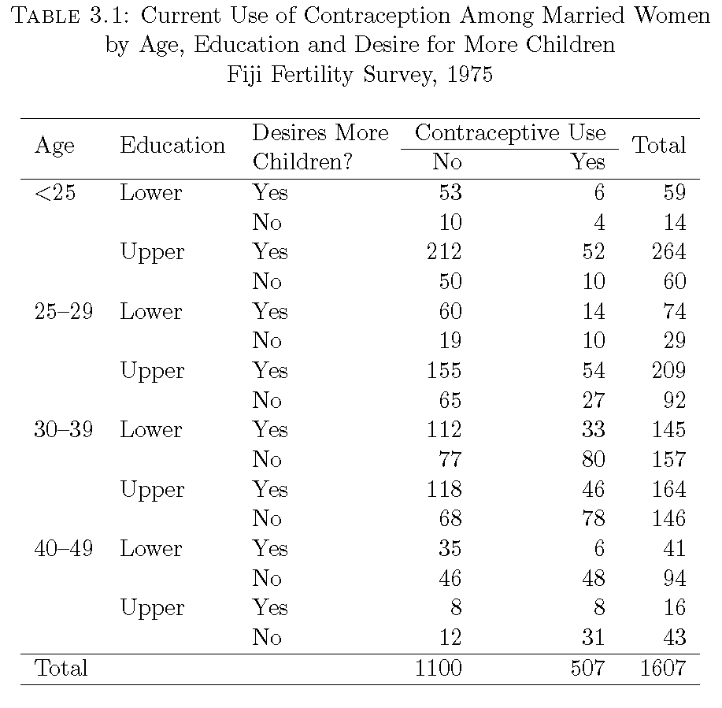

## Logistic regression

*Logistic regression* is a type of generalized linear model, which generalizes the typical linear model to non-Gaussian data. The logistic regression model is linear on the log of the odds: $$\log\frac{\pi_i}{1-\pi_i}=\beta_0+\beta_1x_{1i}+\cdots+\beta_px_{pi},$$ where $\pi_i=Pr(y_i=1)$.
If the parameter $\beta_j>0$, then increasing levels of $x_j$ are associated with higher probabilities that $y=1$, and values of $\beta_j<0$ are associated with lower probabilities that $y=1$. $\beta_j=0$ is consistent with no association between $x_j$ and $y$.

## Binary outcome: the basics

Suppose we have a binary outcome (e.g., $Y=1$ if diseased and $Y=0$ if not) and predictors on a variety of scales.


If the predictors are discrete and the binary outcomes are independent, we can use the Bernoulli distribution for individual 0-1 data or the binomial distribution for grouped data that are counts of successes in each group.

## Models for binary outcomes

  Contingency tables for continuous predictors (and more than a few categorical predictors) can quickly become unwieldy, so we need a new analytic method to model $\pi=Pr(Y=1)$.  


One strategy might be to fit a linear regression model to the probabilities, e.g. model $$\pi_i=\beta_0+\beta_1x_i.$$  The problem is that as a probability, $\pi_i$ must be in the interval $[0,1]$, but there is nothing in the model that enforces this constraint, so that you could be estimating probabilities that are negative or that are greater than 1 -- not a good thing!  

## Models for binary outcomes

An alternative that is sometimes used is to fit the model $$\pi_i=\exp(\beta_0+\beta_1x_i),$$  which is equivalent to $$\ln(\pi_i)=\beta_0+\beta_1x_i.$$  While exponentiating the linear predictor ($\beta_0+\beta_1x_i$) does ensure our estimated values of $\pi_i$ are not negative, they can still be greater than 1.  This is not ideal either.

Note: statisticians often use $\ln$ and $\log$ interchangeably to mean the natural log. If base 10 logarithms are desired, the notation $\log_{10}$ is typically used.

## Logistic regression

An attractive solution is to model the log odds (also called the *logit*) using $$\ln\left(\frac{\pi_i}{1-\pi_i}\right)=\beta_0+\beta_1x_i,$$ which is equivalent to

$$\frac{\pi_i}{1-\pi_i}=\exp(\beta_0+\beta_1x_i),$$ which defines a multiplicative model for the odds.  For example, if we change the $j$th predictor by one unit while holding the other variables constant, we multiply the odds by $\exp(\beta_j)$ because $\exp(\beta_j(x+1))=\exp(\beta_jx)\exp(\beta_j)$.

## Logistic regression

$$\log\frac{\pi_i}{1-\pi_i}=\beta_0+\beta_1x_{i}$$
In this model, the odds of $y=1$ for participants at covariate level $x_i$ are given by $e^{\beta_0+\beta_1x_i}$, and the odds of $y=1$ for participants at covariate level $x_i+1$ are given by $e^{\beta_0+\beta_1(x_i+1)}$. We often describe the association between $x$ and $y$ in terms of the *odds ratio* (OR) given by $\frac{e^{\beta_0+\beta_1x_i+\beta_1}}{e^{\beta_0+\beta_1x_i}}=e^{\beta_1}$.  

Here, $e^{\beta_1}$ is the odds ratio comparing participants who have $x_i$ values one unit higher than counterparts who are otherwise similar.

## Logistic regression model

In this model, 

$$\pi_i=\frac{\exp(\beta_0+\beta_1x_i)}{1+\exp(\beta_0+\beta_1x_i)}.$$  

The expression on the right is called a *logistic function* and cannot yield a value that is negative or a value that is $>1$. A model of this form is known as a *logistic regression* model.

\vspace{.1in}

Other transformations (also called links) can be used to ensure the probabilities lie in $[0,1]$, including the probit (popular in econometrics) and complementary log-log.  

## Interpreting parameters in logistic regression
Typically we interpret functions of parameters in logistic regression rather than the parameters themselves.  For the model $$\log\left\{\frac{\pi_i}{1-\pi_i}\right\}=\beta_0+\beta_1x_i,$$ we note that the probability that $Y=1$ when $X=0$ is $$\frac{\exp(\beta_0)}{1+\exp(\beta_0)}.$$


## Interpreting parameters in logistic regression
Suppose that $X$ is a binary (0/1) variable, e.g. $X=1$ for Duke and $X=0$ for UNC.  In this case, the coefficient $\beta_1$ has a special interpretation:  we interpret $\exp(\beta_1)$ as the odds ratio of the response for the two possible levels of $X$.  For $X$ on other scales, $\exp(\beta_1)$ is interpreted as the odds ratio of the response comparing two values of $X$ one unit apart.


Why?  The log odds of response for $X=1$ is given by $\beta_0+\beta_1$, and the log odds of response for $X=0$ is $\beta_0$.  So the odds ratio of response comparing $X=1$ to $X=0$ is given by $\frac{\exp(\beta_0+\beta_1)}{\exp(\beta_0)}=\exp(\beta_1)$.


In a \emph{multiple logistic regression} model with more than one predictor, this OR is interpreted conditionally on the values of the other predictors staying fixed at any given values.

## Hypothesis tests in logistic regression
Generally, we wish to know whether the OR=1 or equivalently whether the log OR (a $\beta$ coefficient)=0.  To test $H_0:\beta_j=0$, we can compare the ratio of a parameter estimate to its standard error using $$z=\frac{\widehat{\beta}_j-0}{\sqrt{\widehat{\text{var}}(\widehat{\beta}_j)}},$$ comparing this z-statistic to the standard normal distribution.  

## Confidence intervals 

Confidence intervals for the effects on the logit scale, 
$\widehat{\beta}_j \pm 1.96\sqrt{\widehat{\text{var}}(\widehat{\beta}_j)}$, are typically translated into confidence intervals for OR's by exponentiating the lower and upper confidence limits as $\exp\left(\widehat{\beta}_j \pm 1.96\sqrt{\widehat{\text{var}}(\widehat{\beta}_j)}\right)$.


## Bernoulli versus binomial

Recall that the sum of $n$ iid Bernoulli(p) random variables is binomial(n,p)

The logistic regression model can be used either for Bernoulli data (as we did in our causal inference case study) or for data summarized as binomial counts. 

## Contraceptive use data

To illustrate, we consider data on contraceptive use as a function of age, education, and desire for more from the Fiji Fertility Survey, provided online by German Rodriguez. This survey was given in 1974 to a group of women who were aged 15-49 who had been married at least once.

{width=40%}


## Read data into R

```{r fiji}
cuse <- read.table("http://data.princeton.edu/wws509/datasets/cuse.dat", header=TRUE)
```

## Model

Researchers believe that contraceptive use is related to a woman's age, her desire for more children, and her level of education. They expect an interaction between age and desire for more children due to the relationship between age and fertility.

Thus researchers will fit the model  \begin{eqnarray*}
\log\frac{\pi_i}{1-\pi_i}&=&\beta_0+\beta_1I(25\leq age_i \leq 29) + \beta_2I(30 \leq age_i \leq 39) \\ & & +\beta_3I(40 \leq age_i \leq 49) + \beta_4 I(morekids_i) \\ & & + \beta_5 I(lowedu_i) + \beta_6 I(25\leq age_i \leq 29)I(morekids_i) \\ & & + \beta_7I(30 \leq age_i \leq 39)I(morekids_i) \\ & & + \beta_8   I(40 \leq age_i \leq 49) I(morekids_i)
\end{eqnarray*}

## Fitting the model

When using summary counts, we can provide R with the outcome counts in a matrix, with the first column indicating counts of "successes" (these will be treated as $y=1$ occurrences) and the second column indicating counts of "failures" ($y=0$). Note that when we specify binomial data, the default link is the logit link.

```{r fitcont}
m1=glm( cbind(using,notUsing) ~ age * wantsMore + education , family=binomial, 
        data=cuse)
```


## Output
```{r fitcontsum}
summary(m1)
```


## Interpreting the model results
```{r confint}
exp(cbind(OR = coef(m1), confint.default(m1)))
```

For simplicity, we can start by interpreting education, which is not involved in the interaction terms. At a given age and level of desire for more children, women with low levels of education have only 0.71 (95\% CI=(0.56, 0.91)) times the odds of using contraceptives as women with higher levels of education.

## Interpreting the age terms

The main effect terms in age describe the association between age and contraceptive use *in the subgroup of women who do not want more children* (interaction term 0), comparing each older age group to women under 25. 

Thus given the same education level, a woman aged 40-49 who does not want more children has 6.97 (95\% CI=(3.50, 13.86)) times the odds of using contraceptives as a woman <25 who also does not want more children. If you look at the other age levels, women aged 30-39 also have significantly higher odds of using contraceptives as women <25 who do not want more kids, though women 25-29 are not significantly different in their odds of contraceptive use as their younger counterparts.


## Interpreting the age terms

We also may wish to make comparisons to an age group other than the under 25's. For example, to obtain the odds ratio comparing a woman aged 40-49 to a woman aged 30-39, assuming both do not want more children and have the same educational level, we wish to calculate $$OR=\frac{e^{\beta_0+\beta_3+\beta_5I(lowedu_i)}}{e^{\beta_0+\beta_2+\beta_5I(lowedu_i)}}=e^{\beta_3-\beta_2}.$$

Because our estimates of $\beta_3$ and $\beta_2$ are likely not independent, we cannot simply sum their standard errors to get the appropriate standard error for our odds ratio.

## Linear combinations of parameters

Let $\widehat{\beta}$ indicate our parameter estimates, and let $\widehat{\Sigma}_\widehat{\beta}=\widehat{\text{Cov}(\widehat{\beta})}$.  For a linear combination of parameters defined using the vector $c$ as $\lambda=c'\beta$, we can easily obtain a point estimate as $\widehat{\lambda}=c'\widehat{\beta}$.  Thus our estimate of $e^{\beta_3-\beta_2}$ is given by $c'\widehat{\beta}$= $e^{\widehat{\beta}_3-\widehat{\beta}_2}$, where $c'=\begin{pmatrix} 0 & 0 & -1 & 1 & 0 & 0 & 0 & 0 & 0 \end{pmatrix}$.

Now, to estimate the SE of the linear combination $\widehat{\lambda}=c'\widehat{\beta}$, we use basic linear algebra to obtain $\text{Cov}(c'\widehat{\beta})=c'\Sigma_{\widehat{\beta}}c$ and plug in our estimate $\widehat{\Sigma}_\widehat{\beta}$. Then standard methods are used to calculate a CI for the log OR (estimate $\pm$ 1.96SE), and then to put the CI on the OR scale, the endpoints of the interval estimate are simply exponentiated.

## Linear combinations of parameters in R

R automates this in several functions. In my view, none are really preferable to doing this by hand (feel free to send me your code if you disagree!) -- plus when you do it by hand, you're certain about what you're getting.  

We can define $c$ in R, and pull off the covariance matrix of our estimates using the 'vcov' function.

##  Linear combinations of parameters in R 

Let's  obtain the estimated odds ratio and its 95\% CI comparing a woman aged 40-49 to a woman aged 30-39, assuming both do not want more children and have the same educational level, derived previously as $e^{\beta_3-\beta_2}.$

```{r cont1}
c=c(0,0,-1,1,0,0,0,0,0) #beta3-beta2
m1.40493039.OR=exp(t(c)%*%coef(m1))
m1.40493039.selogOR=t(c)%*%vcov(m1)%*%c
#print OR and 95% CI 
c(exp(t(c)%*%coef(m1)-1.96*sqrt(m1.40493039.selogOR)),m1.40493039.OR,
  exp(t(c)%*%coef(m1)+1.96*sqrt(m1.40493039.selogOR)))
```
So the woman aged 40-49 who wants no more kids has 1.33 (95\% CI=(0.88, 2.00)) times the odds of using contraceptives as her counterpart aged 30-39 who also wants no more kids and has the same level of education.

##  Linear combinations of parameters in R 

Let's  obtain the odds ratio comparing a woman aged 30-39 to a woman aged 25-29, assuming both do not want more children and have the same educational level, which can be derived as $e^{\beta_2-\beta_1}.$

```{r cont2}
c=c(0,-1,1,0,0,0,0,0,0) #beta3-beta2
m1.30392029.OR=exp(t(c)%*%coef(m1))
m1.30392029.selogOR=t(c)%*%vcov(m1)%*%c
#print OR and 95% CI 
c(exp(t(c)%*%coef(m1)-1.96*sqrt(m1.30392029.selogOR)),m1.30392029.OR,
  exp(t(c)%*%coef(m1)+1.96*sqrt(m1.30392029.selogOR)))
```
So the woman aged 30-39 who wants no more kids has 2.73 (95\% CI=(1.73, 4.31)) times the odds of using contraceptives as her counterpart aged 25-29 who also wants no more kids and has the same level of education.

## Now add some interaction terms!

To make comparisons among women who do want more children, we need to add the main effect and interaction terms.  For example, the odds of contraceptive use for a woman aged 40-49 who wants more kids are given by $e^{\beta_0+\beta_3 + \beta_4 +\beta_5 I(lowedu_i) + \beta_8}$, and the odds of contraceptive use for a woman $<25$ who wants more kids are given by $e^{\beta_0+\beta_4+\beta_5 I(lowedu_i)}$. Assuming these women have the same educational level, then the OR is given by $$\frac{e^{\beta_0+\beta_3 + \beta_4 +\beta_5 I(lowedu_i) + \beta_8}}{e^{\beta_0+\beta_4+\beta_5 I(lowedu_i)}}=e^{\beta_3+\beta_8}.$$

## Adding interactions!

```{r cont3}
c=c(0,0,0,1,0,0,0,0,1) #beta3+beta8
m1.4049lt25morekids.OR=exp(t(c)%*%coef(m1))
m1.4049lt25morekids.selogOR=t(c)%*%vcov(m1)%*%c
#print OR and 95% CI 

c(exp(t(c)%*%coef(m1)-1.96*sqrt(m1.4049lt25morekids.selogOR)),m1.4049lt25morekids.OR,
  exp(t(c)%*%coef(m1)+1.96*sqrt(m1.4049lt25morekids.selogOR)))
```
So the woman aged 40-49 who wants more kids has 1.79 (95\% CI=(0.90, 3.53)) times the odds of using contraceptives as her counterpart aged under 25 who also wants more kids and has the same level of education. (Recall the OR was 6.97 for the same comparison among women who did not want more children.)

## Finish describing the results

Using these derivations as a guide, describe the model results using language suitable for publication in a non-statistical journal.  (Translation: you can use the terminology OR and CI but need to be specific about all the comparisons, not expecting the reader to be able to do them by hand.)