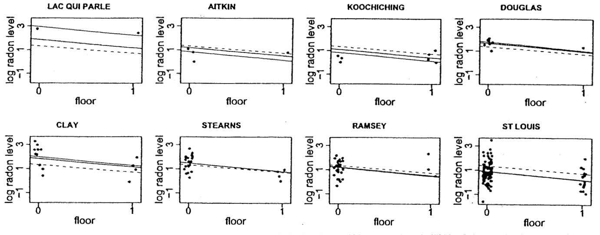
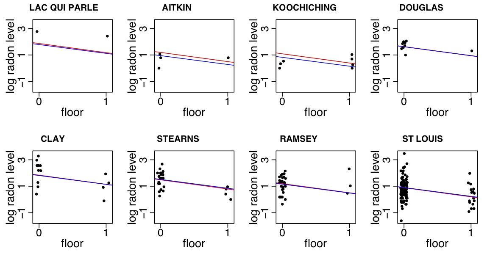
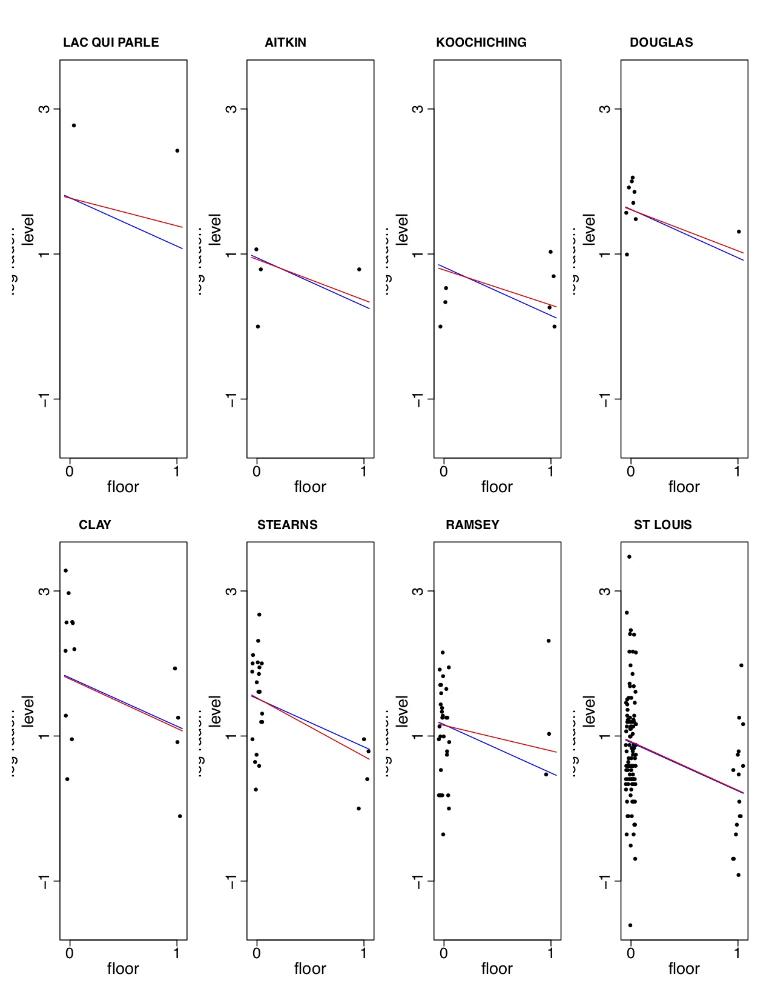

```{r setup, include=FALSE}
library(kableExtra)
library(knitr)
library(tidyverse)
srrs2 <- read.table ("srrs2.dat", header=T, sep=",")
mn <- srrs2$state=="MN"
radon <- srrs2$activity[mn]
log.radon <- log (ifelse (radon==0, .1, radon))
floor <- srrs2$floor[mn]   # 0 for basement, 1 for first floor
n <- length(radon)
y <- log.radon
x <- floor

county.name <- as.vector(srrs2$county[mn])
uniq <- unique(county.name)
J <- length(uniq)
county <- rep (NA, J)
for (i in 1:J){
  county[county.name==uniq[i]] <- i
}

srrs2.fips <- srrs2$stfips*1000 + srrs2$cntyfips
cty <- read.table ("cty.dat", header=T, sep=",")
usa.fips <- 1000*cty[,"stfips"] + cty[,"ctfips"]
usa.rows <- match (unique(srrs2.fips[mn]), usa.fips)
uranium <- cty[usa.rows,"Uppm"]
u <- log (uranium)
u.full<-u[county]
```
## Multilevel models

Multilevel models are a natural way to handle correlated or clustered data. Our goals for studying multilevel modeling include the following.

- Understanding consequences of ignoring correlation in data

- Learning how to construct and apply multilevel models for correlated data

- Using multilevel models to borrow information to inform predictions for continuous and categorical data.


## Clustered data
Clustering of observations generally leads to positive correlation among members of the same unit due to shared characteristics.

- The TAAG Study (Trial of Activity for Adolescent Girls) is a study of school-based interventions to promote physical activity.  The schools themselves are randomized to the interventions, and the girls are clustered within schools (also within grades in schools).

- In studies of social determinants of health, we may study families clustered by neighborhood within a community.  

## Clustered data 
- In developmental toxicity studies, pregnant dams are dosed with a study chemical, and outcomes are measured in the offspring.

- In a longitudinal study, repeated measurement occasions are nested within subjects (e.g., measure height of kids annually)

## Hierarchical linear model

The *hierarchical linear model* is the dominant approach to analysis of multilevel data.  The correlation induced by clustering is described by random effects at each "level."  The higher levels in the hierarchy involve clusters of members at the lower levels.

## Pooling motivation

Multilevel regression is a method for compromising between two extremes: 

- Excluding a categorical predictor from a model (complete pooling)
- Estimating separate models within each level of the categorical
  predictor (no pooling)
  
  
Sometimes, the no pooling approach is not a good option due to limited sample sizes within groups. With a multilevel model, we can get decent estimates for small groups by borrowing information.

## Radon study

Radon, a naturally-occurring radioactive gas, is a carcinogen known to cause lung cancer in high concentrations.  Several thousand lung cancer deaths in the US per year are attributable to radon exposure.

Radon levels in US homes varies greatly, and some homes have dangerously high radon levels.  In order to identify areas of the US with high radon exposures, the US EPA conducted a study of radon levels in a random sample of more than 80,000 homes.

## Radon study

We wish to estimate the distribution of radon levels in houses $i$ within 85 counties $j$ in Minnesota.  

- One estimate would be the average of all radon levels in Minnesota (same estimate for all counties), $\overline{y}_{\cdot \cdot}$, but this ignores variation across counties, and some counties may have higher radon levels naturally than others (radon is more commonly found in soils with granite rock, as opposed to some other soil types).

- Another estimate would be just to average the radon level in each
  county, $\overline{y}_j$, which can over-fit the data within county (for example, Lac Qui Parle County, which has the highest radon level of all the 85 MN counties, has radon measures from only 2 homes). 

## Data exploration
{width=70%}
    
## Radon study

The multilevel estimates in the previous slide represent a compromise between the two extremes.  In this simple setting (with no predictors), the multilevel estimate for county $j$ can be approximated as a weighted average of the mean of all observations in the county (the unpooled estimate $\overline{y}_j$), and the mean over all counties (the completely pooled estimate, $\overline{y}_{\cdot \cdot}$).
}

## Radon study

$$\widehat{\alpha}_j \approx
\frac{\frac{n_j}{\sigma^2_y}\overline{y}_j+\frac{1}{\sigma^2_{\alpha}}\overline{y}_{\cdot\cdot}}{\frac{n_j}{\sigma^2_y}+\frac{1}{\sigma^2_{\alpha}}},$$
    where 
    
- $n_j$ is the number of homes measured in county $j$

- $\sigma^2_y$ is the within-county variance in the log radon
  measurements
  
- $\sigma^2_{\alpha}$ is the variance across the average log radon
  levels of different counties

## Radon study

The weighted average reflects the relative amount of information available on each individual county, compared to that available across all counties.

- Averages from counties with smaller sample sizes are less precise, so the weighting shrinks the multilevel estimates closer to the overall state average.  For example, if $n_j=0,$ the multilevel estimate is just $\overline{y}_{\cdot \cdot}$.

- Averages from counties with larger sample sizes are more precise, and the multilevel estimates are closer to the county averages.  As $n_j \rightarrow \infty$, the multilevel estimate is just the county average $\overline{y}_j$.

- In intermediate cases, the multilevel estimate is in between the
  extremes.

## Radon study

In practice, we carry out all estimation together (estimate variances along with the $\alpha$ parameters), but we won't worry about this yet.

Code for the radon analysis [is available at this link](http://www.stat.columbia.edu/~gelman/arm/examples/radon/radon_chap12.R)  .


## Location of measurement in radon study

One important predictor of radon levels is the floor on which the measurement is taken:  basement ($x_i=0$) or first floor ($x_i=1$); radon comes from underground and can enter more easily when the house is built into the ground.

First, we examine the complete-pooling regression, $y_i=\alpha+\beta x_i + \varepsilon_i$, and the no-pooling regression $y_i=\alpha_{j[i]}+\beta x_i + \varepsilon_i$, where $\alpha_{j[i]}$ is the mean log radon level from basement
measures of homes (indexed by i) in county $j$. 

The following plot shows the solid lines $\widehat{y}=\widehat{\alpha}+\widehat{\beta} x$ for eight selected counties from the no pooling model, and the dashed lines
$\widehat{y}=\widehat{\alpha}_j+\widehat{\beta}x$ from the complete pooling model.

## No pooling and pooling

{width=70%}
  
## Interpretation

The estimates of $\beta$ differ slightly for the two regressions, with $\widehat{\beta}=-0.61$ for the pooling model, and $\widehat{\beta}=-0.72$ for the no-pooling model. [(Click here for code)](radoncode.html) 

Neither analysis is perfect.  The complete-pooling analysis ignores variation in radon levels between counties, which is undesirable because our goal is to identify counties with high-radon homes -- we can't pool away the main
research question!  The no-pooling analysis is also problematic -- for example the Lac Qui Parle County line is estimated based on just two data points.

## Multilevel model

We will start with a simple multilevel model, $y_i=\gamma_0 +
\alpha_{j[i]}+\beta x_i + \varepsilon_i$, where now $\alpha_{j} \sim N(0,\sigma^2_\alpha)$.  We fit this model using the lmer() function in the lme4 package -- [click here for code](radoncode.html).

This model can also be written $y_i \sim N(\alpha_{j[i]}+\beta x_i, \sigma_y^2),$ 

$\alpha_j \sim N\left(\gamma_0,\sigma_\alpha^2 \right)$

## Code to fit multilevel model


```{r M1}
library(lme4)
#basic MLM with just random intercept for county
M1<-lmer(y~x+(1|county))
```

## Output from MLM
```{r M1out}
summary(M1)
```

<small> The ratio of county-level variance to total variance is an estimate of the correlation of within-county measures. Here $\hat{\rho}=\frac{.1077}{.1077+.5709}=0.16$. </small>

## County-level estimates
```{r M1colevel}
coef(M1)
```

The first column gives estimates of $\alpha_j$, and the second column gives the estimate of $\beta$ (does not vary over county $j$ according to the model we specified), for the first 19 of 85 counties.

## Multilevel model fit
{width=90%}
    
Note that there is strong pooling in counties with few data points (multilevel
line is closer to the dashed line, as in Lac Qui Parle county), and weak
pooling in counties with more data points (multilevel line essentially on top of no pooling line in St. Louis county).

## Adding a county-level covariate

Radon comes from uranium that has been in the ground since the earth's
formation.  A measure of average uranium content of the soil was available at
the county level (but not for each house).  We will extend our model to
account for variability across counties due to uranium levels in the soil:
$y_i=\alpha_{j[i]}+\beta x_i + \varepsilon_i,$ where $\alpha_{j} \sim
N(\gamma_0,\sigma^2_\alpha)$ and $\varepsilon_i \sim N(0,\sigma^2_y)$.
To include the county-level uranium measure, $u_j$, as a predictor, we just
modify the model so that $\alpha_{j} \sim N(\gamma_0 + \gamma_1
u_j,\sigma^2_\alpha)$.

## Code for including uranium
```{r M2}
# Extended model adding uranium but still only letting county effect be random
M2<-lmer(y~x+u.full+(1|county))

```

## Uranium model output
```{r M2out}
summary(M2)
```
## Uranium model coefficients
```{r M2coef}
coef(M2) 
```

## Model with and without uranium

{width=90%}


## Allowing home floor term to vary by county

We could also allow the effect of home floor to vary by group:

$y_i=\alpha_{j[i]}+\beta_{j[i]} x_i + \varepsilon_i$, where $\varepsilon_i \sim N(0,\sigma^2_y)$ and $\begin{pmatrix}\alpha_{j} \\ \beta_{j} \end{pmatrix}
\sim N\Big(\begin{pmatrix}\gamma_0 + \gamma_1u_j \\ \gamma_2 \end{pmatrix},\begin{pmatrix} \sigma^2_\alpha & \rho \sigma_\alpha \sigma_\beta \\ \rho \sigma_\alpha \sigma_\beta & \sigma^2_\beta \end{pmatrix}\Big).$

This model is called a random intercepts and slopes model.

## Code to allow varying home floor term
```{r M3}
M3<-lmer(y~x+u.full+(1+x|county))
```

## Output

```{r M3out}
summary(M3)
```
Note the uncertainty around the random effect of floor is large; we may want to eliminate this random term from the model to simplify things.

## Estimates of county-level effects
```{r M3est}
coef(M3)
```

## Model with and without varying "slope" for floor

{width=40%}

