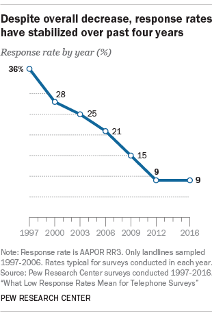

```{r setup, include=FALSE}

```
## Example: Elections

National opinion polls are conducted by a variety of organizations (e.g., media, polling organizations, campaigns) leading up to elections.

While many of the best opinion polls are conducted at a national level, often estimating opinions at state (or even local) levels is a primary goal of some poll consumers.

Well-designed polls are generally based on national random samples with corrections for nonresponse based on a variety of demographic factors (e.g., sex, ethnicity, race, age, education).

AMYAMY put the slide on results of response to my fake poll here (maybe happiness with Sakai? any way to get anonymous poll package?)

## Breaking down polls by demographic factors

Both voting preferences and tendency to respond to surveys depend on complex combinations of demographic factors.  We consider an example in which these factors include biological sex (male or female), race (African-American or other), age (4 age groups), educational attainment (4 age groups), and 51 state-level units (including DC), and we are interested in $2\times 2\times 4\times 4\times 51=3264$ potential categories of respondents. Clearly, without a very large survey (most political surveys poll around 1000 people), we will need to make assumptions in order even to obtain estimates in each category.

## Why so many factors?

We need a lot of categories because

- we are interested in estimates for states individually

- nonresponse estimates require inclusion of demographics

Any given survey will have very few, or even no, data in many categories. However, this is not a problem if we use a multilevel model, which borrows information across categories to get better within-category estimates.

## How big a problem is nonresponse?



If you want to know more about factors related to response rates on phone election surveys, check out [this extensive analysis by Pew](http://www.pewresearch.org/2017/05/15/what-low-response-rates-mean-for-telephone-surveys/).

