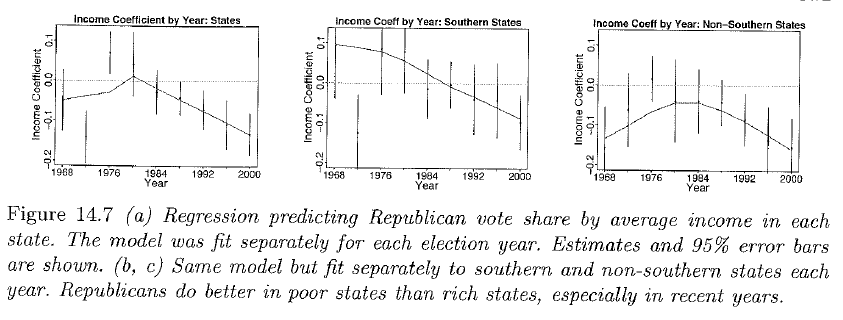

```{r setup, include=FALSE}

```
## US political parties

- In 20th century, Democratic Party widely viewed as the party of the "average American," representing the interests of the lower classes
- Recently, the perception has changed to that of a party representing liberal elites
- Patterns are complex
    - In recent presidential election, Democrats have done better in the richer states in the Northeast and West (often colored blue on electoral maps); Republicans have dominated the poorer "red states" in the South
    - Based on census and opinion poll data, we see that higher-income voters continue to support Repbulicans in presidential elections
- How do we reconcile these seemingly conflicting patterns? We review the case study by [Gelman et al](https://5harad.com/mse331/papers/gelman_et_al_rich_poor.pdf) to see.

## Case study questions

Using a series of models, Gelman and colleagues (in an analysis also described in Gelman and Hill, Chapter 14) address the following questions.

(1) To what extent do richer states favor the Democrats?
(2) At the level of the individual voter, to what extent do richer voters support the Republicans?
(3) Within any given state, to what extent do richer voters support the Republicans?  (How much does context matter?)

## Regression models of state averages

First we examine results of a regression model predicting the Republican share of the two-party vote as a function of state average per capital income (in tens of thousands of dollars, adjusted to 1996 dollars).  The figure shows how the income coefficient estimates are decreasing over time, indicating that richer states have become less likely to vote Republican, and poorer states have become more likely to vote Republican. These patterns have been consistent in the South (and elsewhere) for the past 20 years.

{width=80%} 

## Logistic regression models of individual votes

Using individual-level data from National Election Study polls, a logistic regression model was fit with the outcome of voting Republican and with family income treated as an ordinal predictor (-2=0-16thth\%ile, -1=17-33\%ile, 0=34-67\%ile, 1=68-95\%ile, 5=96-100\%ile). These models were fit separately for each poll year, with positive coefficients implying richer voters preferred Republican candidates, and negative coefficients implying richer voters preferred Democratic candidates. Coefficients are plotted by year on the next slide and show that richer voters have consistently supported Republicans over time.

## Individual voter preference by income level

{width=100%} 


## Reconciling state-level and individual-level trends

Many political commentators are confused by the trends. How do we reconcile the fact that richer states support Democrats, while richer voters support Republicans? We can use a multilevel model to study patterns between and within states simultaneously.

## Multilevel model: Bush vs. Gore (2000)

Using the National Election Survey data (over 100,000 respondents), Gelman et al. fit the following model $$\text{logit}(Pr(y_i=1))=\alpha_{j[i]}+\beta x_i,$$ where $x_i$ is the ordinal individual family income variable, $y_i=1$ if person $i$ votes for the Republican candidate and $y_i=0$ if the Democratic candidate is selected. Further, the state-level intercepts are modeled as a function of state average income $u_j$ as $$\alpha_j \sim N(\gamma_0+\gamma_1u_j, \sigma^2_\alpha),$$ $j=1,\ldots,50$.

This model assumes the relationship between individual income and voter preference is the same in all states but allows the states to have different overall voter preference levels that may be influenced by average state income.

## State-level intercepts
States with higher average income levels are less likely to support Republican candidates.

{width=80%} 

## Individual income relationships
<small> 
Individuals with higher family income levels are more likely to vote Republican. Represented here are a poor state (MS), rich state (CT), and a medium state (OH). The size of open circles represents the relative proportion of households (as compared to national average) in each income level, and the solid circles show the average income level and estimated average support for Bush in each state. Within each state, richer people are more likely to support Bush, but the states with higher income give more overall support to Democrats. </small>

{width=80%}   

## Overall income relationships in this model

{width=40%}  

- Within a state, personal income is positively correlated with Republican vote choice
- Average income varies by state, and the states that support Republicans have more lower-income people
- Poor people in Republican-leaning states tend to be Democrats; rich people in Democratic-leaning states tend to be Republicans

## Varying-intercept, varying-slope model

One question is whether the association between personal income and voting preference depends on the context/state. We can address this question in a model that allows slopes to vary across states.

$$\text{logit}(Pr(y_i=1))=\alpha_{j[i]}+\beta_{j[i]} x_i$$

$$\alpha_j \sim N(\gamma_0+\gamma_1u_j, \sigma^2_\alpha)$$ 
$$\beta_j \sim N(\eta_0+\eta_1u_j, \sigma^2_\beta)$$

## Varying-intercept, varying-slope model

This model can equivalently be expressed as below.

$$\text{logit}(Pr(y_i=1))=\alpha_{j[i]}+\beta_{j[i]} x_i$$

$$\alpha_j = \gamma_0+\gamma_1u_j + \varepsilon_j^\alpha$$

$$\beta_j = \eta_0+\eta_1u_j + \varepsilon_j^\beta$$

$$\varepsilon_j^\alpha \sim N(0,\sigma^2_\alpha), ~~~  \varepsilon_j^\beta \sim N(0,\sigma^2_\beta)$$

## New insights from model

This model reveals variation in within-state slopes, with steeper slopes in poorer states, and shallower slopes in richer states.  Thus income matters more in "red America" than in "blue America."

{width=75%}  


