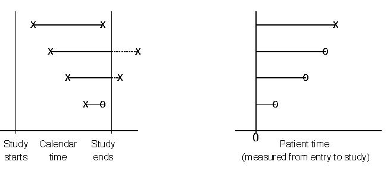

## Survival Data
In many studies, the outcome of interest is the amount of time from an initial observation until the occurrence of some event of interest, e.g.

- Time from transplant surgery until new organ failture
- Time to death in a pancreatic cancer trial
- Time to first sex
- Time to menopause
- Time to divorce
- Time to receipt of degree

Typically, the event of interest is called a *failure* (even if it is a good thing). The time interval between a starting point and the failure is known as the *survival time* and is often represented by $t$.

## Survival Data
Certain aspects of survival data make data analysis particularly challenging.

- Typically, not all the individuals are observed until their times of failure
    - An organ transplant recipient may die in an automobile accident before the new organ fails.
    - A student may withdraw from the program to start a multi-billion dollar start-up
    - Not everyone gets divorced
    - A pancreatic cancer patient may move to Aitutaki instead of undergoing further treatment
- In this case, an observation is said to be *censored* at the last point of contact with the patient.

## Study Time and Patient Time
##{.smaller}


```{r studytime, echo=FALSE, fig.cap="", out.width = '80%'}

```

It is important to distinguish between study time and patient time.

- A study may start enrolling patients in September and continue until all 500 patients have been enrolled
- This is likely to take months or years
- Time is typically converted to patient time (time between enrollment and failure or censoring) before analysis

## Survival Function
The distribution of survival times is characterized by the *survival function*, represented by $S(t)$. For a continuous random variable $T$, 
$$S(t) = Pr(T>t),$$
and $S(t)$ represents the proportion of individuals who have not yet failed.

The graph of $S(t)$ versus $t$ is called a survival curve. The survival curve shows the proportion of survivors at any given time.

##{.smaller}

```{r Vac, echo=FALSE, fig.cap="Survival of Children in Burkina Faso by Vaccination Status", out.width = '80%'}
knitr::include_graphics("figures/burkinafaso.pdf")
```

## Simple Example{.smaller}
A small study enrolls 10 patients, whose outcomes are below.

```{r echo=FALSE, results='asis'}
library(knitr)
Patient <- 1:10
Time <- c(4.5,7.5,8.5,11.5,13.5,15.5,16.5,17.5,19.5,21.5)
Type <- c(0,0,1,0,1,0,0,1,0,1)
table_df <- as.data.frame(cbind(Patient,Time,Type))
table_df$Type <- ifelse(table_df$Type==0,"Death","Censored")
names(table_df) <- c("Patient","Event time (x)","Event Type")
kable(table_df,caption="")
```

How do we estimate the survival curve for these data?

## Kaplan-Meier Estimate{.smaller}
Perhaps the most popular estimate of a survival curve is the *Kaplan-Meier* or *product-limit* estimate. This method is actually fairly intuitive.

First, define the following quantities.

- $I_t$: # at risk of failure at time $t$ (i.e., those who did not fail
before $t$ and those who were not censored before $t$)
- $d_t$: # who fail at time $t$
- $q_t = \frac{d_t}{I_t}$: estimated probability of failing at time $t$
- $S(t)$: cumulative probability of surviving beyond time $t$, estimated as $$\hat{S}(t) = \prod_{t_i \leq t}\Big(1-\frac{d_{t_i}}{I_{t_i}}\Big)$$.

## How is that intuitive?
At each time $t$, the probability of surviving is just 1 − Pr(failing). Before there are any failures in the data, our estimated $\widehat{S}(t)=1$. At the time of the first failure, this probability falls below 1 and is simply one minus the probability of failing at that time, or $1- \frac{\# \text{failures}}{\# \text{at risk of failing}}$.

After the first failure, things get more complicated. At the time of
the second failure, you can calcuate the conditional probability $1- \frac{\# \text{failures}}{\# \text{at risk of failing}}$, but this # at risk of failing
doesn’t provide the whole picture, as someone else has already died. In fact, this is the conditional probability of surviving now that you’ve made it past the time of the first failure.

## How is that intuitive?
$$\widehat{S}(t) = \prod_{t_i \leq t}\Big(1-\frac{d_{t_i}}{I_{t_i}}\Big)$$

How do you then calculate the total (unconditional) probability of survival? That is just the product of the probability of surviving past the first failure $\times$ the conditional probability of surviving beyond the second failure given that you made it past the first, or

$$\scriptsize{Pr(\text{survived past 1st and 2nd times})}$$
$$=\scriptsize{Pr(\text{survive past 1st time})Pr(\text{survive past 2nd time | survived past 1st time})} $$
$$ = \scriptsize{\Big(1-\frac{\text{# failures at time 1}}{\text{# at risk of failing at failure time 1}}\Big)\Big(1-\frac{\text{# failures at time 2}}{\text{# at risk of failing at failure time 2}}\Big)}$$

If someone is censored, they are no longer at risk of failing at the next failure time and are taken out of the number at risk starting at the time of censoring.

## Kaplan-Meier (KM) Estimate 
##{.smaller}
$$\widehat{S}(t) = \prod_{t_i \leq t}\Big(1-\frac{d_{t_i}}{I_{t_i}}\Big)$$

```{r echo=FALSE, results='asis'}
library(knitr)
t <- c(0,4.5,7.5,8.5,11.5,13.5,15.5,16.5,17.5,19.5,21.5)
Failed <- c(0,1,1,0,1,0,1,1,0,1,0)
Censored <- c(0,0,0,1,0,1,0,0,1,0,1)
Left <- rep(NA,11)
Left[1] <- 10
St <- rep("NA",11)
St[1] <- "1"
table_ex <- as.data.frame(cbind(t,Failed,Censored,Left,St))
names(table_ex) <- c("t","# Failed(d[t])","# Censored",paste("#Left",expression(I[t+1])),"S(t)")
kable(table_ex,caption="")
```


##{.smaller}
$$\widehat{S}(t) = \prod_{t_i \leq t}\Big(1-\frac{d_{t_i}}{I_{t_i}}\Big)$$

```{r echo=FALSE, results='asis'}
Left[2] <- "9"
St[2] <- "1-1/10 = 0.9"
table_ex <- as.data.frame(cbind(t,Failed,Censored,Left,St))
names(table_ex) <- c("t","# Failed(d[t])","# Censored",paste("# Left",expression(I[t+1])),"S(t)")
kable(table_ex,caption="")
```

##{.smaller}
$$\widehat{S}(t) = \prod_{t_i \leq t}\Big(1-\frac{d_{t_i}}{I_{t_i}}\Big)$$

```{r echo=FALSE, results='asis'}
Left[2] <- "9"
St[2] <- "0.9"
Left[3] <- "8"
St[3] <- "0.9*(1-1/9) = 0.8"
table_ex <- as.data.frame(cbind(t,Failed,Censored,Left,St))
names(table_ex) <- c("t","# Failed(d[t])","# Censored",paste("# Left",expression(I[t+1])),"S(t)")
kable(table_ex,caption="")
```


##{.smaller}
$$\widehat{S}(t) = \prod_{t_i \leq t}\Big(1-\frac{d_{t_i}}{I_{t_i}}\Big)$$

```{r echo=FALSE, results='asis'}
Left[3] <- "8"
Left[4] <- 7
St[2] <- "0.9"
St[3] <- "0.8"
St[4] <- "0.8*(1-0/8) = 0.8"
table_ex <- as.data.frame(cbind(t,Failed,Censored,Left,St))
names(table_ex) <- c("t","# Failed(d[t])","# Censored",paste("# Left",expression(I[t+1])),"S(t)")
kable(table_ex,caption="")
```

##{.smaller}
$$\widehat{S}(t) = \prod_{t_i \leq t}\Big(1-\frac{d_{t_i}}{I_{t_i}}\Big)$$

```{r echo=FALSE, results='asis'}
Left[3] <- "8"
Left[4] <- 7
Left[5] <- 6
St[2] <- "0.9"
St[3] <- "0.8"
St[4] <- "0.8"
St[5] <- "0.8*(1-1/7) = 0.69"
table_ex <- as.data.frame(cbind(t,Failed,Censored,Left,St))
names(table_ex) <- c("t","# Failed(d[t])","# Censored",paste("# Left",expression(I[t+1])),"S(t)")
kable(table_ex,caption="")
```

##{.smaller}
$$\widehat{S}(t) = \prod_{t_i \leq t}\Big(1-\frac{d_{t_i}}{I_{t_i}}\Big)$$

```{r echo=FALSE, results='asis'}
Left[3] <- "8"
Left[4] <- 7
Left[5] <- 6
Left[6] <- 5
St[2] <- "0.9"
St[3] <- "0.8"
St[4] <- "0.8"
St[5] <- "0.69"
St[6] <- "0.69"
table_ex <- as.data.frame(cbind(t,Failed,Censored,Left,St))
names(table_ex) <- c("t","# Failed(d[t])","# Censored",paste("# Left",expression(I[t+1])),"S(t)")
kable(table_ex,caption="")
```

##{.smaller}
$$\widehat{S}(t) = \prod_{t_i \leq t}\Big(1-\frac{d_{t_i}}{I_{t_i}}\Big)$$

```{r echo=FALSE, results='asis'}
Left[3] <- "8"
Left[4] <- 7
Left[5] <- 6
Left[6] <- 5
Left[7] <- 4
St[2] <- "0.9"
St[3] <- "0.8"
St[4] <- "0.8"
St[5] <- "0.69"
St[6] <- "0.69"
St[7] <- "0.69*(1-1/5) = 0.552"
table_ex <- as.data.frame(cbind(t,Failed,Censored,Left,St))
names(table_ex) <- c("t","# Failed(d[t])","# Censored",paste("# Left",expression(I[t+1])),"S(t)")
kable(table_ex,caption="")
```

##{.smaller}
$$\widehat{S}(t) = \prod_{t_i \leq t}\Big(1-\frac{d_{t_i}}{I_{t_i}}\Big)$$

```{r echo=FALSE, results='asis'}
Left[3] <- "8"
Left[4] <- 7
Left[5] <- 6
Left[6] <- 5
Left[7] <- 4
Left[8] <- 3
St[2] <- "0.9"
St[3] <- "0.8"
St[4] <- "0.8"
St[5] <- "0.69"
St[6] <- "0.69"
St[7] <- "0.552"
St[8] <- "0.552*(1-1/4) = 0.414"
table_ex <- as.data.frame(cbind(t,Failed,Censored,Left,St))
names(table_ex) <- c("t","# Failed(d[t])","# Censored",paste("# Left",expression(I[t+1])),"S(t)")
kable(table_ex,caption="")
```

##{.smaller}
$$\widehat{S}(t) = \prod_{t_i \leq t}\Big(1-\frac{d_{t_i}}{I_{t_i}}\Big)$$

```{r echo=FALSE, results='asis'}
Left[3] <- "8"
Left[4] <- 7
Left[5] <- 6
Left[6] <- 5
Left[7] <- 4
Left[8] <- 3
Left[9] <- 2
St[2] <- "0.9"
St[3] <- "0.8"
St[4] <- "0.8"
St[5] <- "0.69"
St[6] <- "0.69"
St[7] <- "0.552"
St[8] <- "0.414"
St[9] <- "0.414"
table_ex <- as.data.frame(cbind(t,Failed,Censored,Left,St))
names(table_ex) <- c("t","# Failed(d[t])","# Censored",paste("# Left",expression(I[t+1])),"S(t)")
kable(table_ex,caption="")
```

##{.smaller}
$$\widehat{S}(t) = \prod_{t_i \leq t}\Big(1-\frac{d_{t_i}}{I_{t_i}}\Big)$$

```{r echo=FALSE, results='asis'}
Left[3] <- "8"
Left[4] <- 7
Left[5] <- 6
Left[6] <- 5
Left[7] <- 4
Left[8] <- 3
Left[9] <- 2
Left[10] <- 1
St[2] <- "0.9"
St[3] <- "0.8"
St[4] <- "0.8"
St[5] <- "0.69"
St[6] <- "0.69"
St[7] <- "0.552"
St[8] <- "0.414"
St[9] <- "0.414"
St[10] <- "0.414*(1-1/2) = 0.207"
table_ex <- as.data.frame(cbind(t,Failed,Censored,Left,St))
names(table_ex) <- c("t","# Failed(d[t])","# Censored",paste("# Left",expression(I[t+1])),"S(t)")
kable(table_ex,caption="")
```

##{.smaller}
$$\widehat{S}(t) = \prod_{t_i \leq t}\Big(1-\frac{d_{t_i}}{I_{t_i}}\Big)$$

```{r echo=FALSE, results='asis'}
Left[3] <- "8"
Left[4] <- 7
Left[5] <- 6
Left[6] <- 5
Left[7] <- 4
Left[8] <- 3
Left[9] <- 2
Left[10] <- 1
Left[11] <- 0
St[2] <- "0.9"
St[3] <- "0.8"
St[4] <- "0.8"
St[5] <- "0.69"
St[6] <- "0.69"
St[7] <- "0.552"
St[8] <- "0.414"
St[9] <- "0.414"
St[10] <- "0.207"
St[11] <- "0.207"
table_ex <- as.data.frame(cbind(t,Failed,Censored,Left,St))
names(table_ex) <- c("t","# Failed(d[t])","# Censored",paste("# Left",expression(I[t+1])),"S(t)")
kable(table_ex,caption="")
```

What would $\widehat{S}(21.5)$ be if the last observation were a failure instead of censored? 

## KM Estimate

In between failure times, the KM estimate does not change but is constant. This gives the estimated survival function its step-like appearance (we call this type of function a *step function*).

## Tumors in Children, 2012 *Neuro-Oncology*{.smaller}

```{r atct, echo=FALSE, fig.cap="ACTC is an imaging-based biomarker of tumor prognosis.", out.width = '50%'}
knitr::include_graphics("figures/atct.pdf")
```


## Tumors in Children, 2012 *Neuro-Oncology*{.smaller}

- Which biomarker values are associated with the best survival?
- Which values are associated with the worst survival?
- What is the median survival time in the group with the smallest ATCT values?
- If a child is in the group with the largest ATCT values, what is his/her estimated 5-year survival probability?

## Survival Analysis in R
##{.smaller}
We use the "ovarian" data set, which comprises a cohort of ovarian cancer patients and respective clinical information. 

- The response variable is `futime`, the survival time. 
- `fustat` tells if an individual patients' survival time is censored (0=censor, 1=death). 
- Patients in this study received either one of two therapy regimens (`rx`), coded 1 and 2
- The attending physician assessed the health condition after chemotherapy (`resid.ds`=1 if residual disease is absent and 2 if present) as well as ovarian function (`ecog.ps`).

```{r,message=FALSE}
library(survival)
library(survminer)
data(ovarian)
```

##{.smaller}
```{r, message=FALSE}
# Fit survival data using the Kaplan-Meier method
surv_object <- Surv(time = ovarian$futime, event = ovarian$fustat)
surv_object
fit1 <- survfit(surv_object ~ rx, data = ovarian)
summary(fit1)
```

##{.smaller}
Examine the corresponding survival curve using the `ggsurvplot` function. Vertical lines indicate censored data, their corresponding x values at the time which censoring occurred.
```{r,message=FALSE,out.width='60%'}
ggsurvplot(fit1, data = ovarian, pval = TRUE)
```

##{.smaller}
```{r,message=FALSE,out.width='60%'}
# Examine predictive value of residual disease
fit2 <- survfit(surv_object ~ resid.ds, data = ovarian)
ggsurvplot(fit2, data = ovarian, pval = TRUE)
```

##Log-Rank Test
##{.smaller}
How do we determine whether the difference in survival curves is statistically significant (i.e., how was that p-value calculated)?

The log-rank test is quite intuitive. The idea behind it is to construct a $2 \times 2$ contigency table by group (therapy regimens or residual disease status) at each time $t$ at which a failure occurs. Then, the Mantel-Haenszel test statistic is used to test for differences between the two groups. For this test, the null hypothesis is that the survival curves in the two groups are the same, e.g.
$$ H_0: S_{\text{regimen 1}}(t) = S_{\text{regimen 2}}(t)$$

## {.smaller}
```{r,message=FALSE}
# log rank test of 2 regimens
survdiff(surv_object~rx,data=ovarian)
# log rank test of residual disease status
survdiff(surv_object~resid.ds,data=ovarian)
```
Also notice that, the `pval = TRUE` argument in `ggsurvplot` function plots the p-value of a log rank test as well.

##{.smaller}
Reference: https://www.datacamp.com/community/tutorials/survival-analysis-R

## Cox Proportional Hazards Model

How do we extend inference beyond single variable comparisons from the log-rank test? The *Cox Proportional Hazards Model* (Cox, 1972) was proposed in one of the most highly-cited papers in biostatistical science (nearing 50,000, and the model is so popular it is often not cited any more)

In this framework, we model the hazard at time $t$, $h(t)$, as a function of both a baseline hazard rate, $h_0(t)$, and changes to that rate as a function of covariates $z_i$. 

## Cox Proportional Hazards Model

The Cox model is given by

$$h(t)=h_0(t)e^{\beta z_i}$$

We interpret $e^\beta$ as the hazard ratio comparing two participants in a study who have $z_i$ values one unit apart (in the same flavor as an interpretation of an OR in logistic regression). This is a semi-parametric model, as the baseline hazard $h_0(t)$, often considered a nuisance, is estimated nonparametrically. (Parametric alternatives are available if you can specify a distribution for $h_0(t)$.)

## Fitting the Cox model to the ovarian data

Let's fit a Cox model to the ovarian data. First, we'll recode the predictors resid.ds, rx, and ecog.ps to be 0-1 variables

```{r predrecode}
ovarian$residyes=ovarian$resid.ds-1 #2=yes goes to 1 and 1=no to 0
ovarian$trt1=2-ovarian$rx #1 stays 1 and 2 goes to 0
ovarian$ecog1=2-ovarian$ecog.ps
ovarian$age10=ovarian$age/10 #10-year difference for better interpretability
```

## Fitting the Cox model to the ovarian data

```{r fitcox}
fit.coxph <- coxph(surv_object ~ rx + resid.ds + age10 + ecog.ps, 
                   data = ovarian)
```

## Interpreting results

```{r plot, out.width="80%"}
ggforest(fit.coxph, data=ovarian)
```

## Interpreting results

```{r replot, echo=FALSE, out.width="60%"}
ggforest(fit.coxph, data=ovarian)
```

Most of the predictors are not strongly related to survival (see interval estimates and p-values). However, we see that each 10-year increase in age is associated with 3.5 times the hazard of death (95% CI=1.4-8.7).