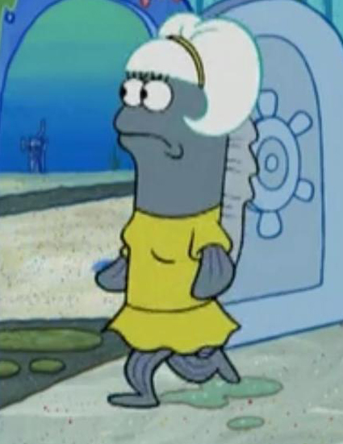

```{r, echo=FALSE, include=FALSE}
library(kableExtra)
library(knitr)
library(tidyverse)
```
On to fish modeling!

  


# Learning Objectives

- gain experience modeling data independently of any team members

# Case Study Goals

The goals of this case study are to explore factors (including year, location, bottom depth, bottom temperature, surface temperature) that are related to species abundance (measured by kg/hectare in the variable `WTCPUE` and \#/hectare in the variable `NUMCPUE`). A particular interest is in exploring whether there are any trends in time, temperature, or other factors in the data. Species to investigate will be assigned on an individual basis, upon request to the instructor.


Case studies will be graded at the end of the semester by the instructor and used as a source of additional information for students who feel their efforts are not adequately reflected in grades for group case studies. These case study reports will not be used to make adjustments to grades of A- or higher.

# Data

The data are available on Sakai under Resources in the "Something's Fishy" folder. Note that data are contained in multiple files split by areas and in some cases years within areas and that data should be merged for analysis. Variables of interest include the following. 

- Latitude, longitude, and station (location where organisms were collected; stations can be located on [this map](http://www.afsc.noaa.gov/RACE/groundfish/survey_data/default.htm))
- Year 
- WTCPUE (kg/hectare of the relevant species)
- NUMCPUE (number of members of the species/hectare)
- Scientific and common names (you'll be assigned a species to explore but are free to use presence of other species if you wish in your analysis)
- Bottom depth
- Bottom temperature
- Surface temperature
- Vessel, cruise, and haul number (a given boat may take multiple trips/cruises, and on any given cruise multiple hauls or nets full of fish may be examined)

# Report

The report itself should be structured with an introduction, description of methods, results, and discussion. All code should be fully reproducible. Use of informative graphics is strongly encouraged; graphics should be easily accessible without having to point separately to data, and any graphics or snapshots of them should be included in the final report as well.

Reports will be due no later than Friday, December 7, at the beginning of class.


# Resources

[More about the NOAA Groundfish Assessment Program](http://www.afsc.noaa.gov/RACE/groundfish/survey_data/default.htm)


